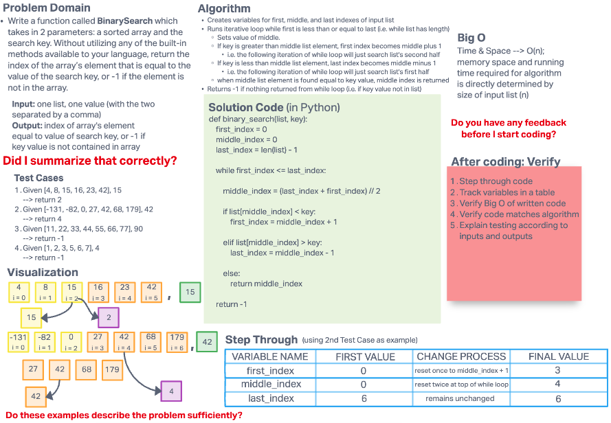

# Binary Search of Sorted Array

The challenge is to write a function which takes in 2 parameters: a sorted list and the search key; without utilizing any of the built-in methods available to your language, it returns the index of the list’s element that is equal to the value of the search key, or -1 if the element is not in the list.

## Whiteboard Process

## Approach & Efficiency

The function takes an iterative approach using a while loop, looking at the middle-indexed element of the input list relative the input key value.

The conditional steps within the while loop:

If the key value is larger than the middle-indexed element, then the next iteration of the while loop will look in the second half of the list by changing the lower bound index to one above the middle index, and then adjusting the middle index for that iteration accordingly.

If the key value is smaller than the middle-indexed element, then the next iteration of the while loop will look in the first half of the list by changing the lower bound index to one below the middle index, and then adjusting the middle index for that iteration accordingly.

Effectively, the list that is being searched continues to be cut in half until
the function finds a middle indexed element equal to the key value input (at which point it will output the index of that element) or will be left with a list to search of 0 length and will then return -1.
