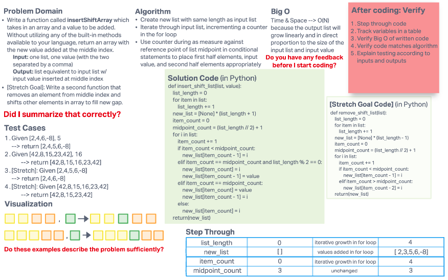

# Insert to Middle of an Array

The challenge was to write a function called insertShiftArray which takes in an array and a value to be added. It must be done without utilizing any of the built-in methods available to your language, and returns an array with the new value added at the middle index.

Stretch Goal (accomplished):

- To write a second function that removes an element from the middle index and shifts other elements in the array to fill the new gap.

## Whiteboard Process

## Approach & Efficiency
<!-- What approach did you take? Discuss Why. What is the Big O space/time for this approach? -->
Utilized for loops (to avoid using any methods whatsoever).

The first `for` loop iterates over the input list to determine its length, so that the new list (that will ultimately be the output list) can be created with `[None]` as the content and a length equal to the input list length + 1.

The second `for` loop iterates over the input list, incrementing an `item_count` variable by 1 for each iteration, and then uses conditional statements (with reference to a `midpoint_count` which is equal to the quotient of the input list length + 1) to handle four different situations with conditional code to execute in each:

- The `if` statement addresses iterations when the `item_count` variable is less than the `midpoint_count` variable. If true, the list element in focus during that iteration will be assigned as the value for the output list element that exists in the output list at an index equal to `item_count - 1` (the subtraction is done because `item_count` has a value of 1 when the conditional statements are first read, but list indexing starts at 0).
- The first `elif` statement addresses the iteration that would occur when two conditions are simultaneously true: `item_count` and `midpoint_count` are equal AND the length of the input list is an even number. If true, then the input value (the one the function is meant to insert) will be assigned to the output list with index of `item_count - 1`, while the list element in focus during that iteration will be assigned as the value for the output list element that exists in the output list at an index equal to `item_count`.
- The second `elif` statement addresses the iteration that would otherwise occur when `item_count` and `midpoint_count` are equal (i.e. the cases when that is true but the input list also has an odd length). If condition true, then the input value will be assigned to the output list with index of `item_count`, while the list element in focus during that iteration will be assigned as the value for the output list element that exists in the output list at an index equal to `item_count - 1`.
- The `else` statement handles the remaining interations (i.e. the normal order remaining sequence of the list elements), assigning each one with an index equal to just `item_count` (rather than one less than the variable value) because the inclusion of the one new element means that indexing and item counting is no longer mismatched at this point.

The Big O space/time is O(N) because the output list will grow linearly and in direct proportion to the size of the input list and input value.
