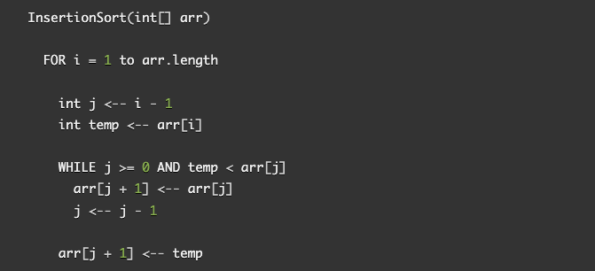
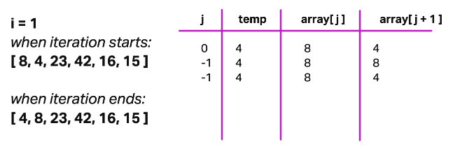
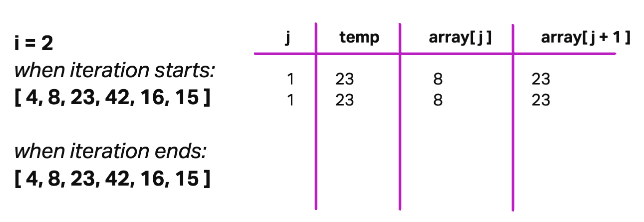
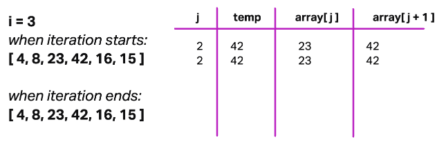
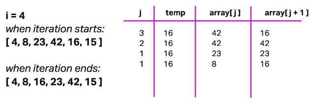
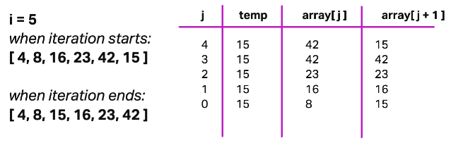

# Insertion Sort

Insertion sort is a sorting algorithm that traverses an input array repeatedly, extracting an array value, comparing it to the unsorted values to its left, and inserting it back into the list such that no values to its left are greater than it. After each array value has been extracted, compared, and inserted, the algorithm is complete and the array is fully sorted.

## Pseudocode

## Walkthrough

Sample Array: `[8, 4, 23, 42, 16, 15]`

### Pass 1

In the first pass, we are evaluating if the value at index 1 is greater than the value to its left. This index is represented by `i` equaling 1. We set the value of `j` to initially be one less than i. We will be using `j` as the pointer to navigate through the items to the left of the value correctly at `i`.

We hold that value at `i` in a helper variable called `temp`. Then a while loop commences (and will repeat) as long as `j` is greater than or equal to zero and `temp` is less than the current array value at index `j`. The first condition exists to ensure the algorithm stops trying to access array elements when it reaches the left edge of the array. The second condition exists because we will no longer need to look left among sorted values once we've found a value that is less than or equal to the `temp` value that we are trying to reinsert into the list: once we find an array value that `temp` isn't less than, we will want to insert `temp` immediately to the right of that value in the array.

On this first pass, going into the while loop, `i` equals 1, `j` equals 0, `temp` is set to hold `4`. Within the while loop, the array value currently at the index of `j+1` is replaced with the value at index `j`. That means `4` is overwritten as `8`. But worry not, we did not lose that value! This is exactly why we were holding it in the `temp` variable.

We then decrement `j` by 1 (so that `j` now equals -1), and this iteration of the while loop ends. We check the conditions that perpetuate the while loop, and since `j` is no longer greater than or equal 0, we break out of the while loop. The last action of the outer for loop iteration is to replace the array element at `j + 1` with the value of `temp`, which means overwriting the first element of the array (`8`) with the value of `4`.

This pass is complete! The following passes follow the same procedure, so now that you've seen it described in detail we can pay more simple attention to how the variables and array elements change throughout each pass.

### Pass 2

Now i = 2 so j initially equals 1, and temp is set to 23. However this time, the array element at index j (equal to 8) is less than the temp value of 23. Since the condition `temp < array[j]` is not true, we do not even start the while loop, and skip right to the last line of the for loop which replaces the array element at index `j + 1` with the value of temp. However since we never decremented j, all this means is overwriting the value of 23 with 23 itself. And the iteration completes with the array unchanged from its state at the beginning of this pass.

### Pass 3

Now i = 3, j = 2, temp = 42, and once again we have hit a scenario where temp is not less than the value of the array at index j (23). The while loop is skipped, 42 is replaced by itself, and the pass is completed with array unchanged.

### Pass 4

Ah now we get some action again. The index in focus (i) is 4, j = 3, temp = 16, and 16 is most definitely less than 42 (the array element at index j).

The while loop commences and in its first iteration 16 is overwritten with 42 and j is decremented to 2. Because 2 >= 0 and temp of 16 is less than the array element at j of value 23, a second iteration of the while loop begins. The 42 at index 3 (j + 1) is overwritten by the value of 23 at index j, and j is once again decremented by 1, so j now equals 1 at the end of this iteration. Since the value at that index is 8 (which is less than temp value of 16), there is not a third iteration of the while loop.

The instance of value 23 at index j+1 is overwritten by the temp value of 16, and pass 4 completes having effectively shifted 16 two spots to the left.

### Pass 5

We'll have some work ahead of us in this pass, because that 15 has got to get moving left! With i=5, j=4, temp=15, and `array[j]` equal to 42, the while loop commences. The 15 is overwritten by 42, and j is decremented to 3. Again with the while loop, 42 at index 4 is overwritten by the value of 23 from index 3, and j is decremented to 2. The while loop iterates a third time, overwriting the 23 at index 3 with the 16 value from index 2, and j is decremeted to 1. Now that `array[j]` is 8 (which is less than temp of 15), we break out of the while loop.

The last thing to do in this pass is to overwrite the 16 at index `j+1` with the temp value of 15. The array is finally sorted, and this is also the final pass as we've reached the end of the range of indexes the algorithm is iterating through. Once this for loop completes, the array is sorted. The writer of the specific function can choose whether to return the array as the last act of the function, or purely use the function for modification purposes.

## Efficiency

- **Time Complexity**: O(n^2) where n is the number of elements in the array. This is due to the nested loops, and while the average case of insertion sort would take about n^2 / 2 steps, the worst case scenario (a completely descending array) would be approximately n^2 steps as there would be a shift made for every comparison.
- **Space Complexity**: O(1), the algorithm has constant use of memory no matter the size of the input array because there are a constant number of variables initialized, no new data structures created, and no recursive calls made.
