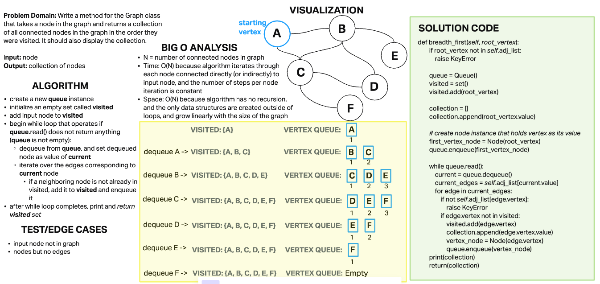

# Challenge Summary

Write the following method for the Graph class:

- breadth first
  - Arguments: Node
  - Return: A collection of nodes in the order they were visited.
  - Display the collection

## Whiteboard Process

## Approach & Efficiency

### Algorithm

- raise a KeyError if the input vertex is not in the graph's adjacency list
- create a new queue instance
- initialize an empty set called visited
- add input vertex to visited
-initialize an empty list called collection
- append the value of the input vertex to the list
- create Node object instance that holds vertex object as its value, name it first_vertex_node
  - this is done so that it can be moved around a node-based queue without changing anything about the Vertex object itself
- enqueue first_vertex_node
- begin while loop that operates if queue.read() does not return anything (queue is not empty):
  - dequeue from queue, and set dequeued node as value of current
  - access list of vertex's edges from graph's adjacency list
  - iterate over the edges
    - raise a KeyError if a neighboring node is not in the graph's adjacency list
    - if a neighboring vertex is not already in visited, add it to visited, append its value to collection, create a Node instance of it, and enqueue it
- after while loop completes, print and return collection

### Efficiency

**Big O for Time:** O(N) where N is number of connected nodes in the graph; because algorithm iterates through each node connected directly (or indirectly) to input node, and the number of steps per node iteration is constant

**Big O for Space:** O(N) because algorithm has no recursion, and the only data structures are created outside of loops, and grow linearly with the size of the graph

## Test/Edge Cases

In addition to passing the provided test, I wrote two additional unit tests.

`test_root_node_not_in_graph()` tests that a KeyError is raised if the input vertex does not exist in the graph (i.e. it is not present in the graph's adjacency list)

`test_root_no_edges()` tests that the actual result meets expected result if the input node is in graph but has no edges (i.e. output would be a collection with only the value of the input node present)
