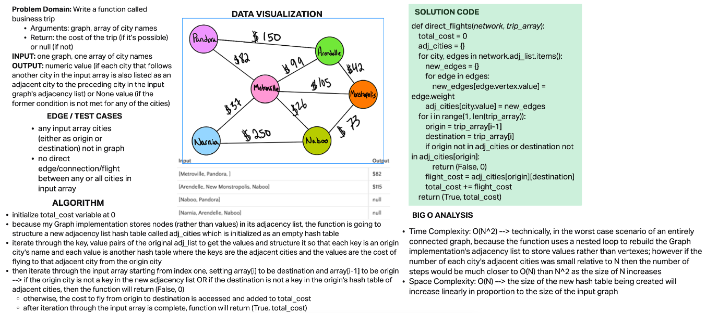

# Challenge Summary

Write a function called business trip:

- Arguments: graph, array of city names
- Return: the cost of the trip (if it’s possible) or null (if not)
- Determine whether the trip is possible with direct flights, and how much it would cost.

## Whiteboard Process

## Approach & Efficiency

- initialize total_cost variable at 0
- because my Graph implementation stores nodes (rather than values) in its adjacency list, the function is going to structure a new adjacency list hash table called adj_cities which is initialized as an empty hash table
- iterate through the key, value pairs of the original adj_list to get the values and structure it so that each key is an origin city's name and each value is another hash table where the keys are the adjacent cities and the values are the cost of flying to that adjacent city from the origin city
- then iterate through the input array starting from index one, setting array[i] to be destination and array[i-1] to be origin --> if the origin city is not a key in the new adjacency list OR if the destination is not a key in the origin's hash table of adjacent cities, then the function will return (False, 0)
  - otherwise, the cost to fly from origin to destination is accessed and added to total_cost
  - after iteration through the input array is complete, function will return (True, total_cost)

## Solution

Function is found in `code_challenges/graph_business_trip.py` and tests are found in `tests/code_challenges/test_graph_business_trip.py`
