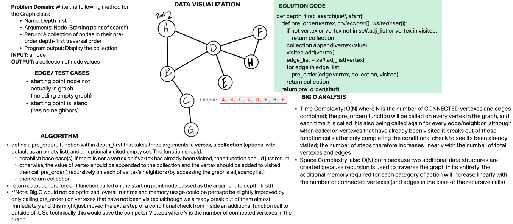

# Depth First Traversal

## Challenge

Write the following method for the Graph class:

- Name: Depth first
- Arguments: Node (Starting point of search)
- Return: A collection of nodes in their pre-order depth-first traversal order
- Program output: Display the collection

## Approach & Efficiency

### Algorithm

- define a pre_order() function within depth_first that takes three arguments: a vertex, a collection (optional with default as an empty list), and an optional visited empty set. The function should:
  - establish base case(s): if there is not a vertex or if vertex has already been visited, then function should just return
  - otherwise, the value of vertex should be appended to the collection and the vertex should be added to visited
  - then call pre_order() recursively on each of vertex's neighbors (by accessing the graph's adjacency list)
  - then return collection
- return output of pre_order() function called on the starting point node passed as the argument to depth_first()
- **Note:** Big O would not be optimized, overall runtime and memory usage could be perhaps be slightly improved by only calling pre_order() on vertexes that have not been visited (although we already break out of them almost immediately and this might just moved the extra step of a conditional check from inside an additional function call to outside of it. So technically this would save the computer V steps where V is the number of connected vertexes in the graph

### Big O

- **Time Complexity:** O(N) where N is the number of CONNECTED vertexes and edges combined; the pre_order() function will be called on every vertex in the graph, and each time it is called it is also being called again for every edge/neighbor (although when called on vertexes that have already been visited it breaks out of those function calls after only completing the conditional check to see its been already visited; the number of steps therefore increases linearly with the number of total vertexes and edges
- **Space Complexity:** also O(N) both because two additional data structures are created because recursion is used to traverse the graph in its entirety; the additional memory required for each category of action will increase linearly with the number of connected vertexes (and edges in the case of the recursive calls)

## Solution

