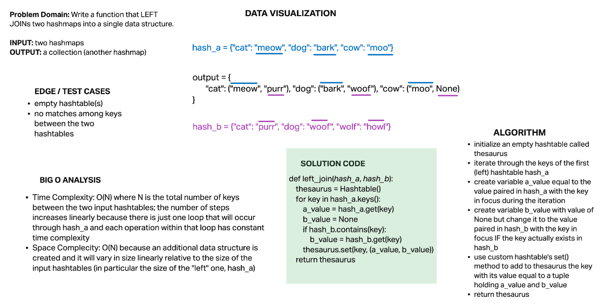

# Hashmap LEFT JOIN

## Challenge

Write a function that LEFT JOINs two hashmaps into a single data structure.

- Write a function called left join
- Arguments: two hash maps
  - The first parameter is a hashmap that has word strings as keys, and a synonym of the key as values.
  - The second parameter is a hashmap that has word strings as keys, and antonyms of the key as values.
- Return: The returned data structure that holds the results is up to you. It doesn’t need to exactly match the output below, so long as it achieves the LEFT JOIN logic

**NOTES:**

- Combine the key and corresponding values (if they exist) into a new data structure according to LEFT JOIN logic.
- LEFT JOIN means all the values in the first hashmap are returned, and if values exist in the “right” hashmap, they are appended to the result row.
- If no values exist in the right hashmap, then some flavor of NULL should be appended to the result row.

## Approach & Efficiency

### Algorithm

- initialize an empty hashtable called thesaurus
- iterate through the keys of the first (left) hashtable hash_a
- create variable a_value equal to the value paired in hash_a with the key in focus during the iteration
- create variable b_value with value of None but change it to the value paired in hash_b with the key in focus IF the key actually exists in hash_b
- use custom hashtable's set() method to add to thesaurus the key with its value equal to a tuple holding a_value and b_value
return thesaurus

### Big O

- **Time Complexity:** O(N) where N is the total number of keys between the two input hashtables; the number of steps increases linearly because there is just one loop that will occur through hash_a and each operation within that loop has constant time complexity
- **Space Complecity:** O(N) because an additional data structure is created and it will vary in size linearly relative to the size of the input hashtables (in particular the size of the "left" one, hash_a)

## Solution

