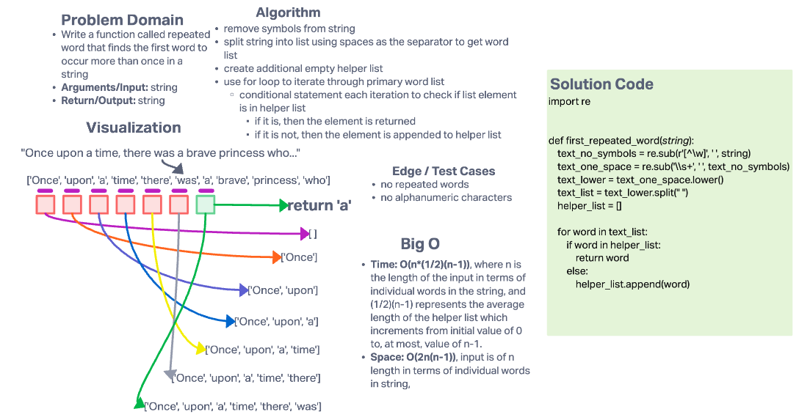

# Hashmap Repeated Word

## Challenge

Write a function called repeated word that finds the first word to occur more than once in a string

- Arguments: string
- Return: string

## Whiteboard Process

## Approach & Efficiency

### Approach

- remove symbols from string
- split string into list using spaces as the separator to get word list
- create additional empty helper list
- use for loop to iterate through primary word list
  - conditional statement each iteration to check if list element is in helper list
    - if it is, then the element is returned
    - if it is not, then the element is appended to helper list

### Efficiency

- Time: **O(n*(1/2)(n-1))**, where n is the length of the input in terms of individual words in the string, and (1/2)(n-1) represents the average length of the helper list which increments from initial value of 0 to, at most, value of n-1.
- Space: **O(2n(n-1))**, input is of n length in terms of individual words in string
