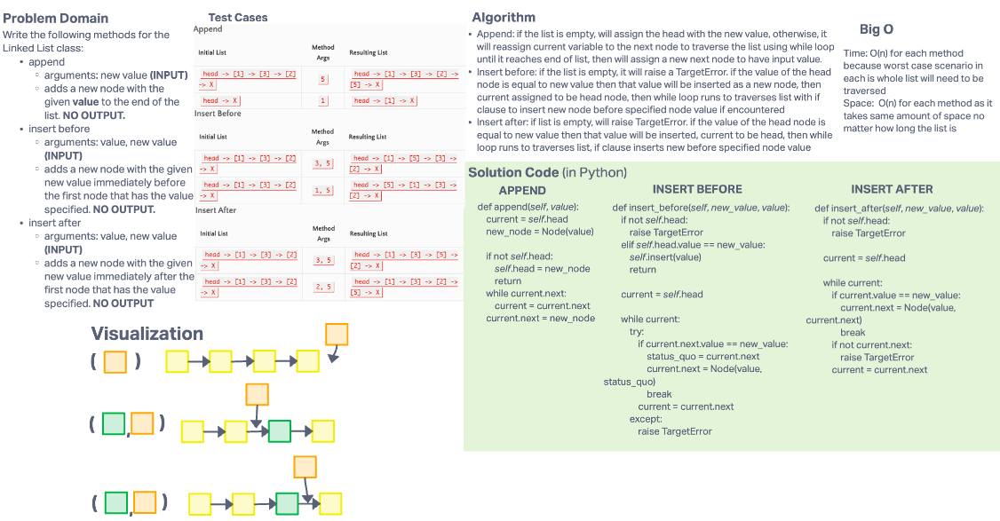

# Challenge Summary

Write the following methods for the Linked List class:

- append
  - arguments: new value
  - adds a new node with the given value to the end of the list
- insert before
  - arguments: value, new value
  - adds a new node with the given new value immediately before the first node that has the value specified
- insert after
  - arguments: value, new value
  - adds a new node with the given new value immediately after the first node that has the value specified

## Whiteboard Process

## Approach & Efficiency

### Approach

- Append: if the list is empty, will assign the head with the new value, otherwise, it will reassign current variable to the next node to traverse the list using while loop until it reaches end of list, then will assign a new next node to have input value.
- Insert before: if the list is empty, it will raise a TargetError. if the value of the head node is equal to new value then that value will be inserted as a new node, then current assigned to be head node, then while loop runs to traverses list with if clause to insert new node before specified node value if encountered
- Insert after: if list is empty, will raise TargetError. if the value of the head node is equal to new value then that value will be inserted, current to be head, then while loop runs to traverses list, if clause inserts new before specified node value

### Big O

- Time: O(n) for each method because worst case scenario in each is whole list will need to be traversed
- Space:  O(n) for each method as it takes same amount of space no matter how long the list is
