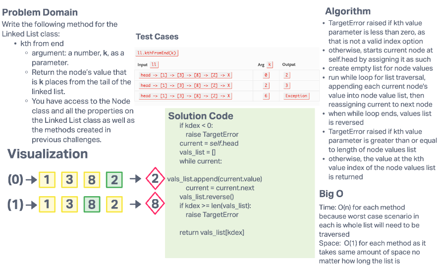

# Challenge Summary

Write the following method for the Linked List class:

- kth from end
  - argument: a number, k, as a parameter.
  - Return the node’s value that is k places from the tail of the linked list.
  - You have access to the Node class and all the properties on the Linked List class as well as the methods created in previous challenges.

## Whiteboard Process

## Approach & Efficiency

### Approach

- TargetError raised if kth value parameter is less than zero, as that is not a valid index option
- otherwise, starts current node at self.head by assigning it as such
- create empty list for node values
- run while loop for list traversal, appending each current node's value into node value list, then reassigning current to next node
- when while loop ends, values list is reversed
- TargetError raised if kth value parameter is greater than or equal to length of node values list
- otherwise, the value at the kth value index of the node values list is returned

### Efficiency

- Time: O(n) for each method because worst case scenario in each is whole list will need to be traversed
- Space:  O(1) for each method as it takes same amount of space no matter how long the list is
