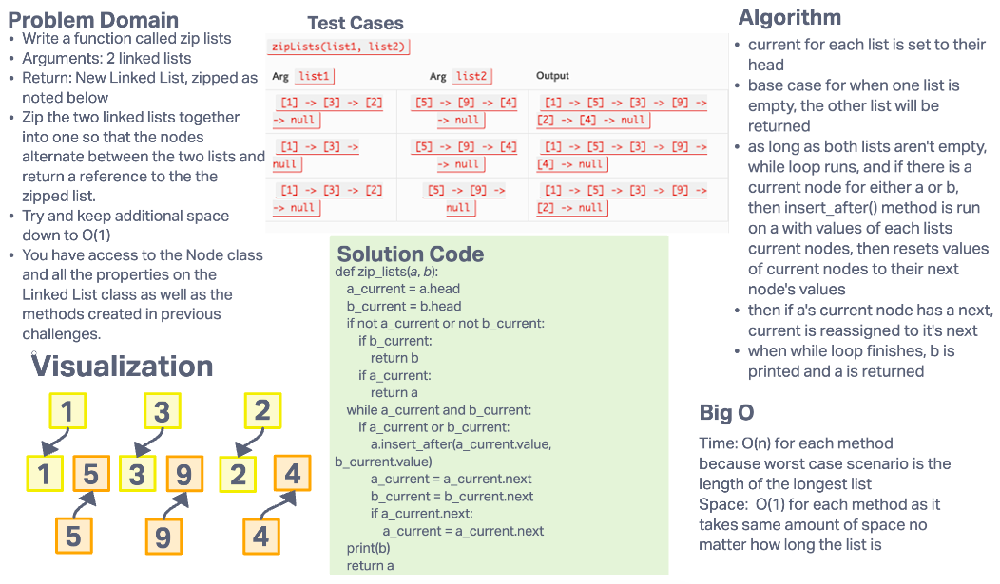

# Challenge Summary

- Write a function called zip lists
- Arguments: 2 linked lists
- Return: New Linked List, zipped as noted below
- Zip the two linked lists together into one so that the nodes alternate between the two lists and return a reference to the the zipped list.
- Try and keep additional space down to O(1)
- You have access to the Node class and all the properties on the Linked List class as well as the methods created in previous challenges.

## Whiteboard Process

## Approach & Efficiency

### Approach

- current for each list is set to their head
- base case for when one list is empty, the other list will be returned
- as long as both lists aren't empty, while loop runs, and if there is a current node for either a or b, then insert_after() method is run on a with values of each lists current nodes, then resets values of current nodes to their next node's values
- then if a's current node has a next, current is reassigned to it's next
- when while loop finishes, b is printed and a is returned

### Efficiency

- Time: O(n) for each method because worst case scenario is the length of the longest list

- Space:  O(1) for each method as it takes same amount of space no matter how long the list is
