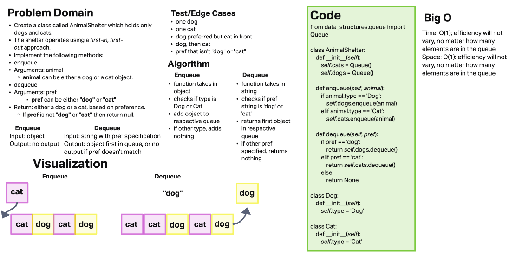

# Stacks Queue Animal Shelter

Create a class called AnimalShelter which holds only dogs and cats. The shelter operates using a first-in, first-out approach.

## Challenge

Implements the following methods:

- enqueue
  - Arguments: animal
    - animal can be either a dog or a cat object.
- dequeue
  - Arguments: pref
    - pref can be either "dog" or "cat"
  - Return: either a dog or a cat, based on preference.
    - If pref is not "dog" or "cat" then return null.

## Whiteboard Process

## Approach & Efficiency

### Approach

Approach was testing first to support debugging of methods.

### Efficiency

- Big O Time: O(1); same amount of time will be used for adding and removing, no matter the length of the data structure
- Big O Space: O(1); same amount of space will be used for adding and removing, no matter the length of the data structure
