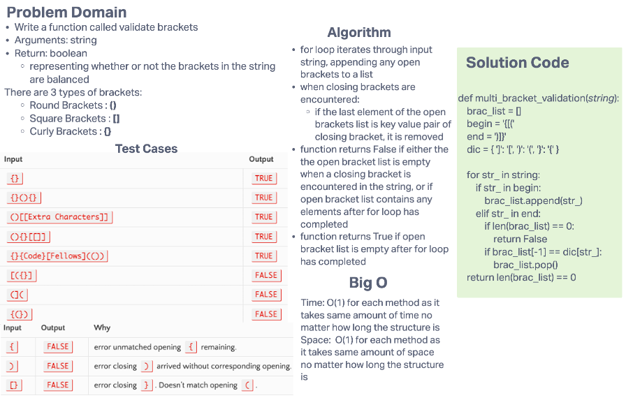

# Stacks Queue Animal Shelter

Write a function called validate brackets that takes in a string and returns a boolean
representing whether or not the brackets in the string are balanced.

## Challenge

Implements the following methods:

- `multi_bracket_validation()`
  - Arguments: string
    - could contain letters, numbers, symbols, any or no brackets, or be empty
  - Returns: True or False indicating if there is a `{[(` for every `)]}`, respectively.

## Whiteboard Process

## Approach & Efficiency

### Approach

Approach was testing first to support debugging of methods.

### Efficiency

- Big O Time: O(1); same amount of time will be used for adding and removing, no matter the length of the data structure
- Big O Space: O(1); same amount of space will be used for adding and removing, no matter the length of the data structure
