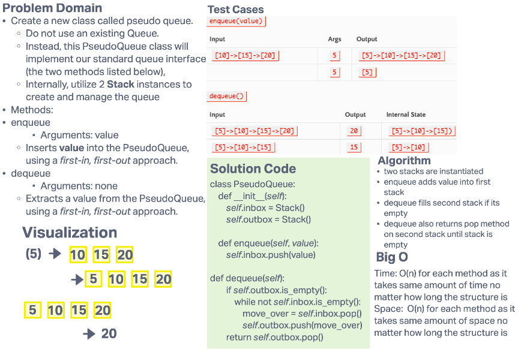

# Challenge Summary

- Create a new class called pseudo queue.
  - Do not use an existing Queue.
  - Instead, this PseudoQueue class will implement our standard queue interface (the two methods listed below),
  - Internally, utilize 2 Stack instances to create and manage the queue
- Methods:
- enqueue
  - Arguments: value
  - Inserts value into the PseudoQueue, using a first-in, first-out approach.
- dequeue
  - Arguments: none
  - Extracts a value from the PseudoQueue, using a first-in, first-out approach.

## Whiteboard Process

## Approach & Efficiency

### Approach

- two stacks are instantiated
- enqueue adds value into first stack
- dequeue fills second stack if its empty
- dequeue also returns pop method on second stack until stack is empty

### Efficiency

- Time: O(n) for each method as it takes same amount of time no matter how long the structure is
- Space:  O(n) for each method as it takes same amount of space no matter how long the structure is
