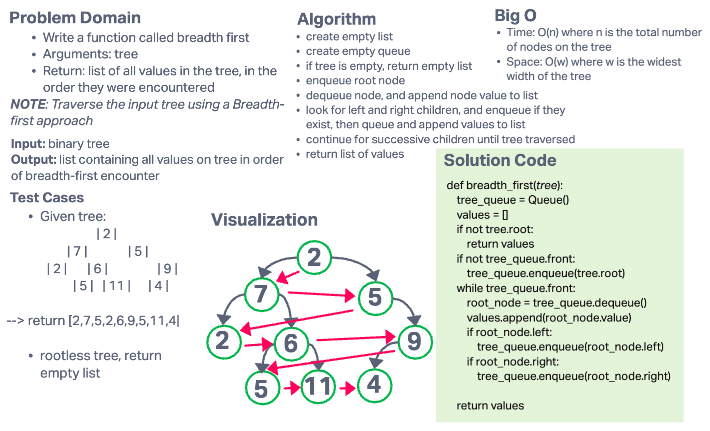

# Challenge Summary

- Write a function called breadth first
- Arguments: tree
- Return: list of all values in the tree, in the order they were encountered
  - NOTE: Traverse the input tree using a Breadth-first approach

## Whiteboard Process

## Approach & Efficiency

### Approach

- create empty list
- create empty queue
- if tree is empty, return empty list
- enqueue root node
- dequeue node, and append node value to list
- look for left and right children, and enqueue if they exist, then queue and append values to list
- continue for successive children until tree traversed
- return list of values

### Efficiency

- Time: O(n) where n is the total number of nodes on the tree
- Space: O(w) where w is the widest width of the tree
