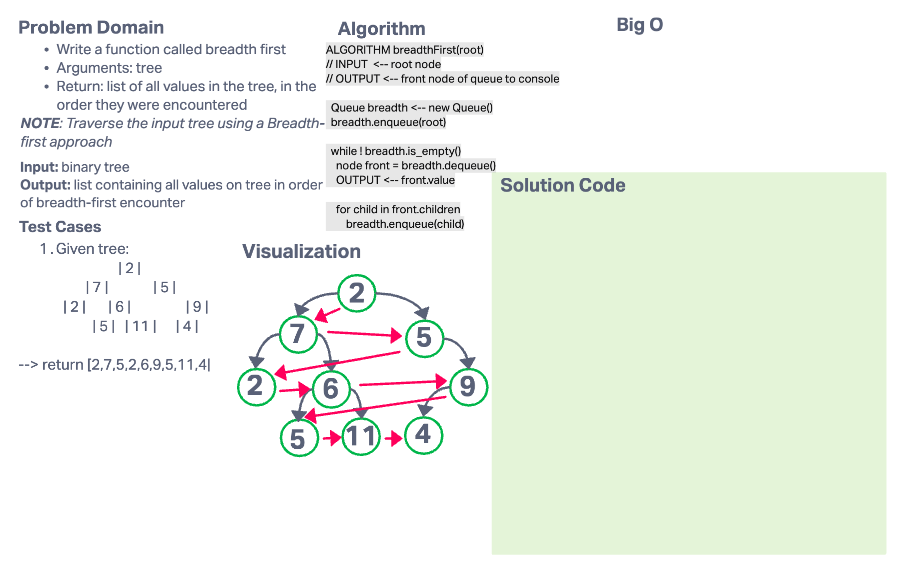

# Challenge Summary

- Write a function called breadth first
- Arguments: tree
- Return: list of all values in the tree, in the order they were encountered
  - NOTE: Traverse the input tree using a Breadth-first approach

## Whiteboard Process

## Approach & Efficiency

### Approach

### Efficiency
