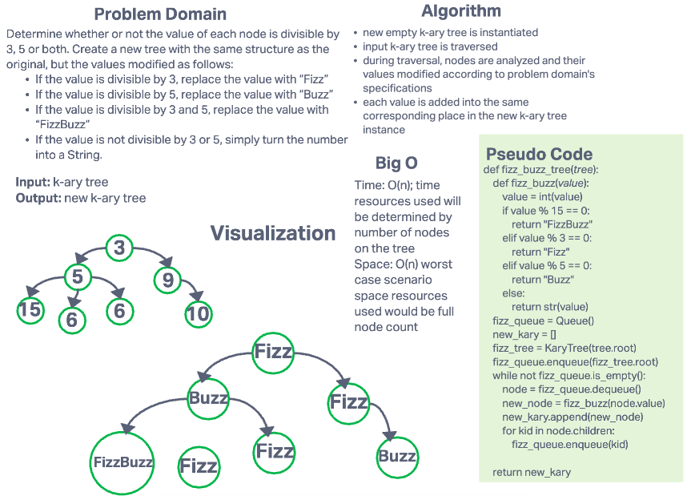

# Challenge Summary

Determine whether or not the value of each node is divisible by 3, 5 or both.

- Create a new tree with the same structure as the original, but the values modified as follows:
  - If the value is divisible by 3, replace the value with “Fizz”
  - If the value is divisible by 5, replace the value with “Buzz”
  - If the value is divisible by 3 and 5, replace the value with “FizzBuzz”
  - If the value is not divisible by 3 or 5, simply turn the number into a String.

## Whiteboard Process

## Approach & Efficiency

### Approach

- new empty k-ary tree is instantiated
- input k-ary tree is traversed
- during traversal, nodes are analyzed and their values modified according to problem domain's specifications
- each value is added into the same corresponding place in the new k-ary tree instance

### Efficiency

- Time: O(n); time resources used will be determined by number of nodes on the tree
- Space: O(n) worst case scenario space resources used would be full node count
