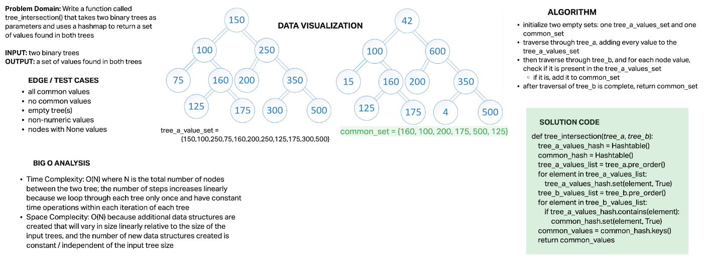

# Challenge Summary

- Write a function called tree_intersection that takes two binary trees as parameters.
- Using your Hashmap implementation as a part of your algorithm, return a set of values found in both trees.

## Whiteboard Process

## Approach & Efficiency

### Algorithm

- initialize two empty sets: one tree_a_values_set and one common_set
- traverse through tree_a, adding every value to the tree_a_values_set
- then traverse through tree_b, and for each node value, check if it is present in the tree_a_values_set
  - if it is, add it to common_set
- after traversal of tree_b is complete, return common_set

### Big O

- **Time Complexity:** O(N) where N is the total number of nodes between the two tree; the number of steps increases linearly because we loop through each tree only once and have constant time operations within each iteration of each tree
- **Space Complecity:** O(N) because additional data structures are created that will vary in size linearly relative to the size of the input trees, and the number of new data structures created is constant / independent of the input tree size

## Solution

Solution can be found in `code_challenges/tree_intersection.py` and tests can be found in `test/code_challenges/test_tree_intersection.py`
