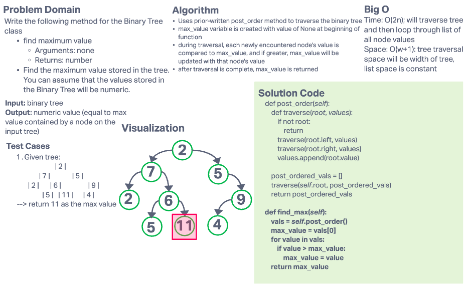

# Challenge Summary

Write the following method for the Binary Tree class

- find maximum value
  - Arguments: none
  - Returns: number

Find the maximum value stored in the tree. You can assume that the values stored in the Binary Tree will be numeric.

## Whiteboard Process

## Approach & Efficiency

### Approach

- Uses prior-written post_order method to traverse the binary tree
- max_value variable is created with value of None at beginning of function
- during traversal, each newly encountered node's value is compared to max_value, and if greater, max_value will be updated with that node's value
- after traversal is complete, max_value is returned

### Efficiency

- Time: O(2n); will traverse tree and then loop through list of all node values
- Space: O(w+1): tree traversal space will be width of tree, list space is constant
